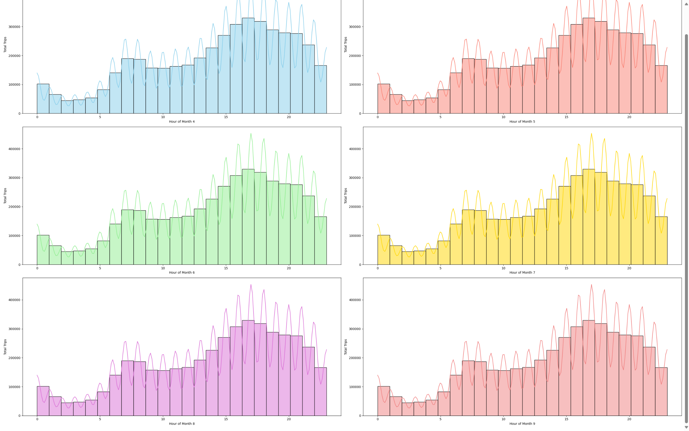
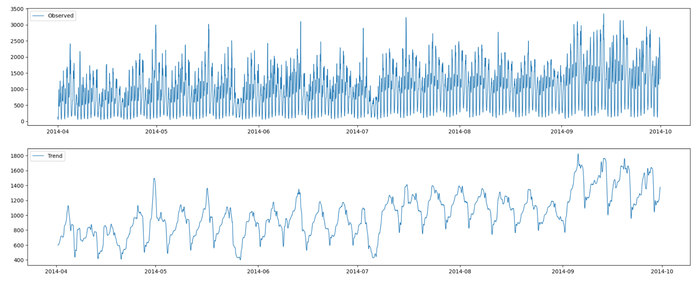
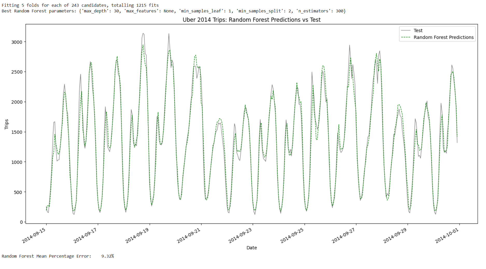

# 🚗 Uber
## 📌 Project objective
This project looks at Uber ride data from New York City between April and September 2014 to understand when and where people are most likely to request rides and other deeper insights. By developing and evaluating models like XGBoost, Random Forest, and Gradient Boosted Tree Regressor to predict future demand, the goal is to help Uber prepare ahead—putting drivers in the right places, reducing wait times, planning promotions, and making better decisions to improve both service and efficiency.
## 🛠 Technologies used
Python (Pandas, NumPy, Matplotlib, Seaborn, XGBoost, Random Forest, Gradient Boosted Tree Regressor, MAPE) by using GoogleColab
## 🏢 About the company
Uber Technologies, Inc., founded in 2009 and headquartered in San Francisco, California, is a leading technology company that revolutionized urban transportation with its ride-sharing platform. The company’s mission is to make transportation as reliable as running water, everywhere, for everyone. Uber’s innovative app connects millions of riders with drivers in over 70 countries, offering a convenient alternative to traditional taxis. 
## 📂 Dataset
- Dataset: [Uber Pickups in New York City](https://www.kaggle.com/datasets/fivethirtyeight/uber-pickups-in-new-york-city/code)
This folder contains data on over 4.5 million Uber pickups in New York City from April to September 2014, collected by the website FiveThirtyEight from the New York Taxi & Limousine Commission (TLC) through a Freedom of Information Act request on July 20, 2015.
The collected data is mainly concentrated in the Bronx and several locations in Manhattan, including:
- Fordham, Bronx (BX)
- Morris Heights, Bronx
- Jerome Ave, Bronx
- High Bridge, Bronx
- Kingsbridge, Bronx
- Williamsbridge, Bronx
- Manhattan (NYC), main routes such as Broadway, 10th Ave NYC, and W 204 St NYC.

## I. Data cleaning
Before processing data, the first step is to import the necessary libraries. These libraries include:
```python
import numpy as np
import pandas as pd
import matplotlib.pyplot as plt
import seaborn as sns
import os
import matplotlib.cm as cm
import plotly.express as px
```
### 1. Loading data:
The data showing the number of Uber trips from April to September 2014 is spread across several CSV files. To keep things organized and consistent, each file is loaded into its own DataFrame using the pd.read_csv() function.
```python
uber_apr14=pd.read_csv('/content/drive/MyDrive/link data uber/uber-raw-data-apr14.csv')
uber_may14=pd.read_csv('/content/drive/MyDrive/link data uber/uber-raw-data-may14.csv')
uber_jun14=pd.read_csv('/content/drive/MyDrive/link data uber/uber-raw-data-jun14.csv')
uber_jul14=pd.read_csv('/content/drive/MyDrive/link data uber/uber-raw-data-jul14.csv')
uber_aug14=pd.read_csv('/content/drive/MyDrive/link data uber/uber-raw-data-aug14.csv')
uber_sep14=pd.read_csv('/content/drive/MyDrive/link data uber/uber-raw-data-sep14.csv')
```
After that, these DataFrames are combined into a single dataset using pd.concat(). The parameter ignore_index=True is used to reset the row indices, making sure the data stays properly ordered and consistent.
```python
uber = pd.concat([df_apr14, df_may14, df_jun14, df_jul14, df_aug14, df_sep14], ignore_index=True)
```
```python
uber.info()
```
<center>
      
  </center>
  
### 2. Checking null values:
```python
uber.isnull().sum()
```
<center>
      
  </center>
  
In this case, a check of the dataset shows that there are no missing values. As a result, there's no need to perform any additional steps like replacing or removing data.
### 3. Checking duplicated values:
```python
uber.duplicated().sum()
```
<center>
      
  </center>
  
The results show that there are 82,581 duplicate rows in the dataset. Since these duplicates don't add any value to the analysis, the drop_duplicates(inplace=True) method is used to remove them directly from the DataFrame.
```python
uber.drop_duplicates(inplace = True)
```
### 4. Time data processing
We can see that the time data is currently in object format, so it's important to convert it to a proper datetime format. After that, we can add new columns to represent the date, hour, and minute to make the analysis easier and more flexible.
```python
uber.rename(columns={'Date/Time':'Date_time'},inplace=True)

uber['Date_time'] = pd.to_datetime(uber['Date_time'])

uber['month'] = uber['Date_time'].dt.month
uber['weekday'] = uber['Date_time'].dt.day_name()
uber['day'] = uber['Date_time'].dt.day
uber['hour'] = uber['Date_time'].dt.hour
uber['minute'] = uber['Date_time'].dt.minute
```
### 5. Data overview:
```python
uber.info()
```
<center>
      
  </center>

```python
print(uber['Date_time'].min())
print(uber['Date_time'].max())
```
<center>
      
  </center>
  
The collected data covers trips from April 1, 2014, to September 30, 2014, totaling 4,451,746 records. Descriptive statistics have been calculated for the time-related column (Date_time), location coordinates (Lat, Lon), and time components such as day (Day), hour (Hour), and minute (Minute).

## II. EDA
### 1. Total Trips
-**By hours**
```python
# Analyze trips by hour across different months
plt.figure(figsize=(30, 20))
colors = ['skyblue', 'salmon', 'lightgreen', 'gold', 'orchid', 'lightcoral']

for i, month in enumerate(uber['month'].unique()):
    plt.subplot(3, 2, i + 1)
    sns.histplot(data=uber, x="hour", bins=24, kde=True, color=colors[i % len(colors)])
    plt.xlabel('Hour of Month {}'.format(month))
    plt.ylabel('Total Trips')

plt.tight_layout()
plt.show()
```
<center>
      
  </center>
  
- **Peak Hours**: Trips increase from early morning, peaking between **3–6 PM**, likely due to post-work or school travel.
- **Secondary Peaks**: Smaller peaks occur around **7–9 AM** and **12–1 PM**, reflecting morning commutes and lunch breaks.
- **Late Night Drop**: After **11 PM**, trip volume drops sharply.
- **Consistent Pattern**: These trends are consistent across all months, indicating stable daily demand unaffected by season.
- **Business Insight**: Targeted pricing or promotions during peak hours could be effective.

-**By day of the week**
```python
# Plot the total trips by day of the week
plt.figure(figsize=(8,8))
sns.countplot(data=uber, x="weekday", hue="weekday", palette="rainbow", legend=False)

# Add title and axis labels
plt.title("Total Number of Trips by Day of the Week", fontsize=16)
plt.xlabel("Day of the Week", fontsize=14)
plt.ylabel("Total Number of Trips", fontsize=14)

# Show the plot
plt.show()
```
<center>
      
  </center>
  
- **Midweek (Thursday, Friday)** sees the **highest** number of trips, exceeding 700,000 per day, likely due to increased travel for work, meetings, and evening activities.
- **Weekends** (Saturday, Sunday) show a **decline**, with **Sunday** having the **lowest** trips (~480,000), possibly because more people stay home or use personal vehicles.

-**By months**
```python
# Analyze total trips by day across different months
plt.figure(figsize=(30, 20))
colors = ['skyblue', 'salmon', 'lightgreen', 'gold', 'orchid', 'lightcoral']

for i, month in enumerate(uber['month'].unique()):
    plt.subplot(3, 2, i + 1)
    sns.histplot(data=uber, x=uber[uber['month'] == month]['day'], bins=31, kde=True, color=colors[i % len(colors)])
    plt.xlabel('Day of Month {}'.format(month))
    plt.ylabel('Total Trips')

plt.tight_layout()
plt.show()
```
<center>
      
  </center>

<center>
      
  </center>
  
- **Demand spikes every 6–7 days**, likely aligning with **Fridays through Sundays**.
- **August and September** are the **busiest months**, possibly due to **seasonal effects** (e.g., end of summer, return to school, or favorable weather).
- **One day is missing in April, June, and September**, likely due to **data entry errors or missing records**.

### 2. Total Trip Hours
-**By day of the week**
```python
# Box plot analyzing Uber trip times throughout the week
sns.boxplot(x='weekday', y='hour', data=uber, hue='weekday', palette='coolwarm', legend=False)
plt.title("Uber Trip Times Throughout the Week")
plt.xlabel("Day of the Week")
plt.ylabel("Hour of the Day")
plt.show()
```
<center>
      
  </center>
  
- The **busiest period is from 10 AM to 7 PM**, capturing the bulk of daily demand.
- The **median trip time stays consistent (~3–4 PM**) across all days, indicating that **Uber usage peaks in the afternoon**. Trips are distributed across the full 24 hours, showing **nearly continuous servic**e.
- **Weekends** (Saturday & Sunday) show **wider variability**, likely due to more **late-night trips** related to social events, while **Weekdays** (Monday to Friday) have **similar, stable patterns** with less variability, reflecting **commuting routines**.
- Overall, the **distribution is quite uniform** across the week, with **few outliers**, suggesting **no major behavioral shift between weekdays and weekends**.

-**By day of the month**
```python
#Total driving hours per day in the month
uber.groupby('day')['hour'].count()
```
<center>
      
  </center>
  
```python
# Analyze total driving hours by day of the month
day_hours = uber.groupby('day')['hour'].count().reset_index(name='Total Driving Hours')

# Use a new colormap
cmap = plt.colormaps['rainbow']

# Create a list of colors from the colormap
colors = [cmap(i / len(day_hours)) for i in range(len(day_hours))]

# Plot a bar chart with vibrant colors
plt.figure(figsize=(20, 10))
bars = sns.barplot(x='day', y='Total Driving Hours', hue='day', data=day_hours, palette=colors, legend=False)

# Add title and axis labels
plt.title("Total Driving Hours by Day of the Month", fontsize=16)
plt.xlabel("Day of the Month", fontsize=14)
plt.ylabel("Total Driving Hours", fontsize=14)

# Show the plot
plt.show()
```
<center>
      
  </center>
  
- Driving hours are **relatively stable** throughout the month, with **low activity in the first few days**, especially on the 1st.
- The **30th** often shows a **noticeable spike** in total driving hours, possibly due to end-of-month activities like salary payments or shopping.
- The **31st** sees a **sharp drop** in total driving hours, likely because not all months have 31 days.

-**By months**
```python
#Analyzes which month has the highest total number of trip hours
uber.groupby('month')['hour'].count()
```
<center>
      
  </center>
  
```python
monthly_trips = uber.groupby('month')['hour'].count().reset_index(name='Total Trip Hours')
colors = ['skyblue', 'salmon', 'lightgreen', 'gold', 'orchid', 'lightcoral']

plt.figure(figsize=(10, 10))
sns.barplot(data=monthly_trips, x='month', y='Total Trip Hours', hue='month', palette=colors, legend=False)
plt.xticks(ticks=[0,1,2,3,4,5], labels=['April', 'May', 'June', 'July', 'August', 'September'])
plt.xlabel('Month')
plt.title("Total Trip Hours by Month", fontsize=16)
plt.show()
```
<center>
      
  </center>
  
- Total driving hours **steadily rise** from **April to September**, **peaking** in **September** with over 1 million hours. The most significant growth occurs between **June and September**, likely due to the **summer tourism peak** in New York, attracting many visitors and boosting Uber demand.
- Warm weather and outdoor activities encourage more travel. **August and September** also see **increased** demand as students and workers **return from summer break**s, especially in **early September**.

### 3. Geolocation
-**Passenger latitude**
```python
days = ["Monday", "Tuesday", "Wednesday", "Thursday", "Friday", "Saturday", "Sunday"]

# Plot the graph
plt.figure(figsize=(15, 10))
sns.pointplot(data=uber, x='hour', y='Lat', hue='weekday', palette="rainbow")

# Set the title (translated to English)
plt.title("Peak Hour Analysis by Passenger Latitude", fontsize=16)

# Automatically get handles and labels to preserve colors
handles, labels = plt.gca().get_legend_handles_labels()

# Add legend with weekday labels and keep colors consistent
plt.legend(handles=handles, labels=days, title="Day of the Week", fontsize=12)
plt.xlabel("Hour", fontsize=14)
plt.ylabel("Latitude", fontsize=14)

# Show the plot
plt.show()
```
<center>
      
  </center>
  
- **Weekday vs Weekend Patterns**: **Monday to Friday** show **higher average latitude**s, indicating that pickups tend to cluster more **northward** (likely in Manhattan). **Saturday and Sunday** have **lower average latitude**s, suggesting more activity **further south** or outside central business areas.
- **Morning Spike (7–9 AM)**: Clear uptick in latitude on **weekdays**, indicating work-related commuting patterns into more northern (business) areas.
- **Evening Decline (after 6 PM)**: Gradual decrease in latitude, implying dispersal from business centers.
- **Late Night Drop (after 10 PM)**: All days show a sharp decline in trip latitude, reflecting lower demand and more scattered locations.

-**Base**
📌 A **base** is a licensed For-Hire Vehicle (FHV) base registered with the New York City Taxi and Limousine Commission (TLC). Each base (e.g., B02598) connects drivers with passengers and reports trip data to the city. Uber operates through multiple such bases, which may represent different regions, partners, or business units within the platform.
```python
uber['Base'].nunique()
```
<center>
      
  </center>
  
```python
#analyzes which locations (bases) have the highest total number of trips by hour
base = uber.groupby(['Base','hour'])['Date_time'].count().reset_index()
base
```
<center>
      
  </center>
  
```python
fig4=px.scatter(base,
            x='hour',
            y='Date_time',
            color='Base',
            template='plotly_dark',
            color_discrete_sequence=['#50F9F1','#6AE5A8','#96C96A','#B7AA47','#C78845'])
fig4.update_layout(title_text='Total Trips by Location and Time of Day', title_x=0.5)


fig4.update_xaxes(title_text="Hour")
fig4.update_yaxes(title_text="Total Trips")

fig4.show()
```
<center>
      
  </center>
  
- Total trips are **lowest** between **2 AM and 5 AM**, reflecting minimal overnight demand.
- Trips begin to **rise steadily after 6 AM**, aligning with the morning commute.
- The **highest** trip volumes occur between **3 PM and 7 PM**, likely due to evening commute and after-work activities.
- There is a **noticeable spike** at **midnight** (12 AM), possibly linked to late-night travel or nightlife.
- Bases **B02598** and **B02617** consistently record **higher trip counts**, while **B02512** and **B02764** have **lower overall activity**.

-**City**
```python
Demand=(uber.groupby(['Lat','Lon']).count()['Date_time']).reset_index()
Demand.columns=['Latitude','Longitude','Number of Trips']
import folium as fo
from folium.plugins import HeatMap
base1=fo.Map()
HeatMap(Demand,zoom=20,radius=15).add_to(base1)
base1
```
<center>
      
  </center>
  
- **Manhattan** is the main **hotspot** for taxi demand due to its **high population density, business centers, tourism, and entertainment**.
- Major routes to **Long Island** and **New Jersey** show **high trip density**, reflecting strong **commuter traffic** between the city and suburbs.
- Other notable hotspots include areas around **Newark Airport**, and suburban zones like **Stamford** and **New Brunswick**, indicating **significant regional travel**.

### 4. Heatmaps
```python
#Heatmap
def count_rows(row):
    return len(row)


def heatmap(col1,col2):
    by_cross = uber.groupby([col1,col2]).size().unstack()
    plt.figure(figsize=(12,8))
    sns.heatmap(by_cross, cmap="coolwarm")
```
```python
#By hour and day of the week
heatmap('weekday', 'hour')
plt.xlabel('Hour')
plt.ylabel('Weekday')
plt.title('Heatmap of Uber Trips by Hour and Day of Week')
plt.show()
```
<center>
      
  </center>
  
```python
#By Hour and Day of the month
heatmap('day', 'hour')
plt.xlabel('Hour of Day')
plt.ylabel('Day of Month')
plt.title('Heatmap of Uber Trips by Day and Hour')
plt.show()
```
<center>
      
  </center>
  
```python
#by month and day of the month
heatmap('month', 'day')
plt.xlabel('Day of Month')
plt.ylabel('Month')
plt.title('Heatmap of Uber Trips by Month and Day of Month')
plt.show()
```
<center>
      
  </center>
  
```python
#by month and weekday 
heatmap('month', 'weekday')
plt.xlabel('Day of Week')
plt.ylabel('Month')
plt.title('Heatmap of Uber Trips by Month and Day of Week')
plt.show()
```
<center>
      
  </center>
  
📝 Key observations
- The peak demand hour 17:00.
- The main customer category are workers.
- An indicator of Uber's improvement from April to September.
- People tend to use Uber to go to work around 7:00 and 8:00 on working days.
- People tend to use Uber late at night (around midnight) during weekends.
- We should investigate why people don't use uber on Mondays as much as they do on other working days.

## III. Machine learning

### 1. Importing the necessary libraries + useful functions
The first step is to import all necessary libraries and include useful functions to make the code below more readable.
```python
import warnings
warnings.filterwarnings("ignore")

import xgboost as xgb
import matplotlib.pyplot as plt
from sklearn.model_selection import KFold
from xgboost import plot_importance, plot_tree
from sklearn.model_selection import train_test_split
from statsmodels.tsa.seasonal import seasonal_decompose
from sklearn.metrics import mean_absolute_percentage_error
from sklearn.ensemble import RandomForestRegressor, GradientBoostingRegressor
from sklearn.model_selection import GridSearchCV, RandomizedSearchCV, TimeSeriesSplit
```
Thanks to the combination of these tools, the model training process becomes more efficient, ensuring that the model does not suffer from overfitting or get affected by outliers in the data. At the same time, optimization techniques help identify the most suitable model for the forecasting problem.

Developing a time series forecasting model involves more than just choosing the right algorithm—data preprocessing, visualization, error evaluation, and feature engineering are equally crucial. The following code provides a comprehensive set of functions to support this end-to-end process.
```python
# Time series decomposition
def PlotDecomposition(result):
    plt.figure(figsize=(22,18))
    plt.subplot(4,1,1)
    plt.plot(result.observed,label='Observed',lw=1)
    plt.legend(loc='upper left')
    plt.subplot(4,1,2)
    plt.plot(result.trend,label='Trend',lw=1)
    plt.legend(loc='upper left')
    plt.subplot(4, 1, 3)
    plt.plot(result.seasonal, label='Seasonality',lw=1)
    plt.legend(loc='upper left')
    plt.subplot(4, 1, 4)
    plt.plot(result.resid, label='Residuals',lw=1)
    plt.legend(loc='upper left')
    plt.show()

# Evaluation of forecasting errors
def CalculateError(pred,sales):
  percentual_errors = []
  for A_i, B_i in zip(sales, pred):
    percentual_error = abs((A_i - B_i) / B_i)
    percentual_errors.append(percentual_error)
  return sum(percentual_errors) / len(percentual_errors)

# Visualization of forecasting results
def PlotPredictions(plots,title):
    plt.figure(figsize=(18, 8))
    for plot in plots:
        plt.plot(plot[0], plot[1], label=plot[2], linestyle=plot[3], color=plot[4],lw=1)
    plt.xlabel('Date')
    plt.ylabel("Trips")
    plt.title(title)
    plt.legend()
    plt.xticks(rotation=30, ha='right')
    plt.show()

#Preparing data for forecasting models
def create_lagged_features(data, window_size):
    X, y = [], []
    for i in range(len(data) - window_size):
        X.append(data[i:i+window_size])
        y.append(data[i+window_size])
    return np.array(X), np.array(y)
```
- **Time series decomposition**
Before building a forecasting model, it’s important to break down the time series into trend, seasonality, and residuals using PlotDecomposition(result). This helps you see if the data has clear patterns the model can learn from. If the trend or seasonality is strong and the residuals look random, your model is likely on the right track. But if the residuals show patterns, it might be time to tweak the model or clean the data.
- **Evaluation of forecasting errors**
After building a model, CalculateError(pred_sales) uses MAPE (Mean Absolute Percentage Error), which shows the average prediction error as a percentage to measure accuracy. A low MAPE means good predictions; a high one suggests the model needs improvement. It's a quick way to gauge forecast reliability.
-**Visualization of forecasting results**
Visualizing forecasts is key to spotting differences between actual and predicted data. It helps identify errors and check if the model follows the trend. If predictions are too noisy, smoothing or data adjustments might be needed. Charts also make it easier for others to understand and make decisions
-**Preparing data for forecasting models**
A good forecasting model depends not just on the algorithm but also on how the data is prepared. The function create_lagged_features(data, window_size) creates lagged features, letting the model learn from past values to predict the future. Choosing the right window size helps capture trends and cycles, improving accuracy. Lagged features also transform time series data into a format suitable for machine learning models like Linear Regression, Random Forests, or Neural Networks. Without this step, models might miss important time dependencies and give poor forecasts.

### 2. Preparing the data
As you will see, one of the key aspects of this (particluarly important) step is resampling it on an hourly basis. Originally, the data isn't time series prediction ready. Once we finish preparing the data, we will be able to begin training models.
```python
# Now make sure the date column is set to datetime, sorted and with an adequate name
uber2014['Date_time'] = pd.to_datetime(uber2014['Date_time'], format='%Y-%m-%d %H:%M:%S')
uber2014 = uber2014.sort_values(by='Date_time')
uber2014 = uber2014.rename(columns={'Date_time':'Date'})
uber2014.set_index('Date',inplace=True)
```
```python
uber2014.head(5)
```
<center>
      
  </center>
  
```python
# Group by hour and count occurrences of 'Base'
hourly_counts = uber2014['Base'].resample('h').count()
# Convert the series to a dataframe
uber2014 = hourly_counts.reset_index()
# Rename columns for clarity
uber2014.columns = ['Date', 'Count']
uber2014.set_index('Date',inplace=True)
```
```python
uber2014.head(5)
```
<center>
      
  </center>

### 3. Choosing the optimal train / test sets
In order to choose the correct train / test sets, we need to first visualize the series, then do a seasonal decompose if the trend can inform us of a suggested approach to that split
```python
# Let's plot the series
plt.figure(figsize=(20, 8))
plt.plot(uber2014['Count'],linewidth = 1, color='darkslateblue')
plt.xticks(rotation=30,ha='right')
plt.show()
```
<center>
      
  </center>
  
```python
result=seasonal_decompose(uber2014['Count'],model='add', period=24*1)
PlotDecomposition(result)
```
<center>
      
  </center>

<center>
      
  </center>
  
The chart gives deeper insight into the data structure. The trend shows gradual growth in trips over time. Seasonality reveals repeating patterns like daily or weekly changes. Residuals represent noise, and if it’s high, the model may need extra preprocessing to clean the data before training.
```python
print(uber2014.index.min())
print(uber2014.index.max())
```
<center>
      
  </center>
 
Choosing a proper split point for training and testing is crucial in time series forecasting. Unlike regular ML tasks, time series splits must ensure the model only learns from the past and predicts the future to avoid data leakage. In the code below, September 15, 2014 is used as the cutoff date.
```
cutoff_date = '2014-09-15 00:00:00'
plt.figure(figsize=(20, 8))
plt.plot(result.trend, linewidth = 1, color='gray')
plt.axvline(x=pd.Timestamp(cutoff_date), color='red', linestyle='--', linewidth=1)
plt.xticks(rotation=30, ha='right')
plt.show()
```
<center>
      
  </center>
  
As seen above, the trend stays relatively stable until around September 2014, and then increases to 4 more peaks. Leaving up to the first 2 peaks as train data and the remaining 2 as test would be sufficient. This is particularly important, because if we did the usual 80/20 split, we would likely encounter errors due to the said trend increase.

```python
uber2014_train = uber2014.loc[:cutoff_date]
uber2014_test = uber2014.loc[cutoff_date:]
```
```python
uber2014_test.rename(columns={'Count':'TEST SET'}).join(uber2014_train.rename(columns={'Count':'TRAINING SET'}), how='outer').plot(figsize=(15,5),title='Train / Test Sets', style='-',lw=1)
```
```python
# Set the window size
window_size = 24

# Split data into training and test sets
X_train, y_train = create_lagged_features(uber2014_train['Count'].values, window_size)
test_data = np.concatenate([uber2014_train['Count'].values[-window_size:], uber2014_test['Count'].values])
X_test, y_test = create_lagged_features(test_data, window_size)
```
```python
seed = 12345
```
### 4. XGBoost
XGBoost is one of the strongest ML algorithms available. However, it is usually prone to overfitting. We avoid it by doing Cross Validation and fine tuning the training process.
```python
tscv = TimeSeriesSplit(n_splits=5)

xgb_param_grid = {
    'n_estimators': [100, 200, 300],
    'max_depth': [3, 6, 9],
    'learning_rate': [0.01, 0.1, 0.3],
    'subsample': [0.6, 0.8, 1.0],
    'colsample_bytree': [0.6, 0.8, 1.0]
}

xgb_model = xgb.XGBRegressor(objective='reg:squarederror', random_state=seed)

xgb_grid_search = GridSearchCV(
    estimator=xgb_model,
    param_grid=xgb_param_grid,
    cv=tscv,
    scoring='neg_mean_absolute_percentage_error',
    n_jobs=-1,
    verbose=1
)
xgb_grid_search.fit(X_train, y_train)
print("Best XGBoost parameters:", xgb_grid_search.best_params_)
```
**Results: {'colsample_bytree': 1.0, 'learning_rate': 0.1, 'max_depth': 6, 'n_estimators': 300, 'subsample': 0.6}**
This means the model performs best when:
- Using 300 decision trees
- Max depth is 6
- Learning rate is 0.1
- Using all features (colsample_bytree = 1.0)

```python
xgb_predictions = xgb_grid_search.best_estimator_.predict(X_test)

PlotPredictions([
    (uber2014_test.index, uber2014_test['Count'], 'Test', '-', 'darkslateblue'),
    (uber2014_test.index, xgb_predictions, 'XGBoost Predictions', '--', 'red')
], 'Uber 2014 Trips: XGBoost Predictions vs Test')

xgb_mape = mean_absolute_percentage_error(uber2014_test['Count'], xgb_predictions)
print(f"XGBoost MAPE:\t{xgb_mape:.2%}")
```
<center>
      
  </center>
  
The model achieved an error of **8.37%**, indicating fairly good performance in the time series forecasting task.

### 5. Random Forest
Random Forests are less susceptible to overfitting. However, for time series tasks, this model has limitations. Random Forests don’t automatically handle the sequential nature of data, so careful preprocessing—like creating lagged features (as in part 3)—is needed. To optimize the model, Grid Search combined with Time Series Cross-Validation is used to find the best parameters and improve forecasting performance.
```python
rf_param_grid = {
    'n_estimators': [100, 200, 300],
    'max_depth': [10, 20, 30],
    'min_samples_split': [2, 5, 10],
    'min_samples_leaf': [1, 2, 4],
    'max_features': [None, 'sqrt', 'log2']
}

rf_model = RandomForestRegressor(random_state=seed)

rf_grid_search = GridSearchCV(
    estimator=rf_model,
    param_grid=rf_param_grid,
    cv=tscv,
    scoring='neg_mean_absolute_percentage_error',
    n_jobs=-1,
    verbose=1
)
rf_grid_search.fit(X_train, y_train)

print("Best Random Forest parameters:", rf_grid_search.best_params_)
```
**Results: {max_depth': 30, 'max_features': None, 'min_samples_leaf': 1, 'min_samples_split': 2, 'n_estimators': 300}**
This means the model performs best when:
- Using 100 decision trees
- Max depth is 30
- Use all features (max_features=None)
- Minimum 2 samples per leaf to reduce overfitting
- Minimum 5 samples required to split a node
  
```python
xgb_predictions = xgb_grid_search.best_estimator_.predict(X_test)

PlotPredictions([
    (uber2014_test.index, uber2014_test['Count'], 'Test', '-', 'darkslateblue'),
    (uber2014_test.index, xgb_predictions, 'XGBoost Predictions', '--', 'red')
], 'Uber 2014 Trips: XGBoost Predictions vs Test')

xgb_mape = mean_absolute_percentage_error(uber2014_test['Count'], xgb_predictions)
print(f"XGBoost MAPE:\t{xgb_mape:.2%}")
```
<center>
      
  </center>
  
Random Forest’s MAPE (**9.61%**) is higher than XGBoost’s (**8.37%**), indicating that it may not perform as well as XGBoost for this task.

### 6. Gradient Boosted Regression Tree
```python
gbr_param_grid = {
    'n_estimators': [100, 200, 300],
    'learning_rate': [0.01, 0.1],
    'max_depth': [3, 4, 5],
    'min_samples_split': [2, 5, 10],
    'min_samples_leaf': [1, 2, 4],
    'max_features': ['sqrt', 'log2']
}

gbr_model = GradientBoostingRegressor(random_state=seed)

gbr_grid_search = GridSearchCV(estimator=gbr_model, param_grid=gbr_param_grid, cv=tscv, n_jobs=-1, scoring='neg_mean_absolute_percentage_error',verbose = 1)
gbr_grid_search.fit(X_train, y_train)

print("Best Random Forest parameters:", gbr_grid_search.best_params_)
```
**Results: {'learning_rate': 0.1, 'max_depth': 5, 'max_features': 'sqrt', 'min_samples_leaf': 2, 'min_samples_split': 2, 'n_estimators': 300}**
This means the model performs best when:
- Learning rate: 0.1
- Using 300 decision trees
- Max depth is 5
- Max features: square root of total features ('sqrt')
- Minimum samples per leaf: 2
- Minimum samples to split a node: 2

```python
gbr_predictions = gbr_grid_search.best_estimator_.predict(X_test)

PlotPredictions([
    (uber2014_test.index,uber2014_test['Count'],'Test','-','gray'),
    (uber2014_test.index,gbr_predictions,'GBRT Predictions','--','orange')],
    'Uber 2014 Trips: GBRT Predictions vs Test')
gbr_mape = mean_absolute_percentage_error(y_test, gbr_predictions)
print(f'GBTR Percentage Error:\t{gbr_mape:.2%}')
```
<center>
      
  </center>
  
The model achieved an error of **10.54%**, indicating relatively good performance in the time series forecasting task.

### 7. Visualizing all models at once
```python
PlotPredictions([
    (uber2014_test.index,uber2014_test['Count'],'Test','-','gray'),
    (uber2014_test.index,xgb_predictions,'XGBoost Predictions','--','red'),
    (uber2014_test.index,gbr_predictions,'GBRT Predictions','--','orange'),
    (uber2014_test.index,rf_predictions,'Random Forest Predictions','--','green')],
    'Uber 2014 Trips: All Models Predictions vs Test')
```
<center>
      
  </center>
  
The above plot shows how all algorithms have actually being very close to predicting the test set. Visually, we can safely assume that using either algorithm could be a safe bet. 

### 8. Ensemble
Building the ensemble requires to understand how each algorithm has performed individually first. Then, decide how we can leverage each one's strenghts to our advantage.
```python
print(f'XGBoost MAPE:\t\t\t{xgb_mape:.2%}')
print(f'Random Forest MAPE:\t\t{rf_mape:.2%}')
print(f'GBTR Percentage Error:\t\t{gbr_mape:.2%}')
```
<center>
      
  </center>
  
Convert MAPE scores to weights: Since MAPE is inversely related to model performance, we can use the reciprocal of MAPE as a starting point for determining the weights. Normalize these reciprocals to get the weights.
```python
# Calculate weights based on inverse MAPE (Mean Absolute Percentage Error)
weights = np.array([1/xgb_mape, 1/rf_mape, 1/gbr_mape])
weights = weights / weights.sum()  # Normalize weights so they sum to 1
print(f"Weights: XGBoost={weights[0]:.3f}, Random Forest={weights[1]:.3f}, GBRT={weights[2]:.3f}")

# Create ensemble predictions by combining XGBoost, Random Forest, and GBRT predictions weighted by their performance
ensemble_predictions = (weights[0] * xgb_predictions +
                        weights[1] * rf_predictions +
                        weights[2] * gbr_predictions)

# Plot the test data and the ensemble forecast for comparison
PlotPredictions([
    (uber2014_test.index, uber2014_test['Count'], 'Test Set', '-', 'gray'),
    (uber2014_test.index, ensemble_predictions, 'Ensemble Model', '--', 'purple')
], 'Uber 2014 Trip Forecast: Test Set vs Ensemble Model')

# Calculate and print the MAPE of the ensemble model
ensemble_mape = mean_absolute_percentage_error(uber2014_test['Count'], ensemble_predictions)
print(f'Ensemble Model Percentage Error:\t{ensemble_mape:.2%}')
```
<center>
      
  </center>
  
### 9. Insights and Conclusions from Training and Evaluation
The training and evaluation of these models underscore the effectiveness of **XGBoost**, with its best-in-class MAPE of **8.37%**. The ensemble model, achieving a **MAPE** of **8.60%**, effectively combines the strengths of the individual models, resulting in robust and reliable predictions. These findings highlight the importance of considering temporal structures in time series data and lay a strong foundation for future predictive modeling efforts in similar applications.


